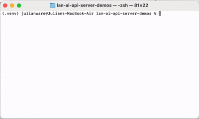

# LAN AI API Server Demos

Essentially, I built a local LAN-accessible AI inference server on a Raspberry PI, hosting tinyllama, and explored interacting with it programmatically.



## Tech Stack
* Python
    * Requests
    * Dotenv
    * JSON

## Project Structure
```
.
├── raw_generation.py   # minimal API request example
├── chat.py             # streaming chat interface with memory
├── calculator.py       # experimental AI calculator demo
├── .env                # local Ollama server URL
├── readme.md
└── media/
```
Note: Each demo stands on its own and do not interact with each other.

## Architecture

Both `raw_generation.py` and `calculator.py` feature the same general architecture.

```
┌────┐
│User│
└────┘
 │
 │ enters prompt
 │ 
 ▼
┌─────────────────────────────────┐
│raw_generation.py / calculator.py│
└─────────────────────────────────┘
 │
 │ sends HTTP POST request to /api/generate
 │ 
 ▼
┌────────────┐
│Raspberry Pi│
└────────────┘ 
 │
 │ Ollama server receive JSON payload
 │
 ▼
┌───────────────┐
│TinyLlama model│
└───────────────┘
 │
 │ runs local inference
 │
 ▼
┌─────────────┐
│Ollama server│
└─────────────┘
 │
 │ returns JSON response
 │
 ▼
┌─────────────────────────────────┐
│raw_generation.py / calculator.py│
└─────────────────────────────────┘
 │
 │ extracts data["response"]
 │
 ▼
┌───────────────┐
│Terminal output│
└───────────────┘
```

### calculator.py

However, on calculator.py, I included a `system prompt`, and modified the `options` values to get more consistent results from the calculator! 

```python
"system": "You are a calculator. Return only the final numeric answer. No words. No explanation. No labels. Only the answer of the expression!",
```

* `system` provides high-level behavorial instructions that guide how the model should respond to the user's prompt

```python
"options": {
    "temperature": 0,
    "top_k": 1,
    "num_predict": 3,
}
```

* `temperature` controls how aggressively probabilities are flattened (lower->stable, higher->wild).
* `top_k`controls how many candidate tokens are allowed. 
* `num_predict` controls how many tokens are output.

Nonetheless, LLMs are token predictors, not symbolic math engines, and TinyLlama <i>still</i> managed to fail spectacularly at 2nd-Grade math! All in all, this goes to show the necessity of implementing tool calling with agents.

### chat.py

```
User
┌────┐
│User│
└────┘
 │
 │ enters message   ◀───────────────-──────────────────────────────┐
 │                                                                 │
 ▼                                                                 │   
┌───────┐                                                          │
│chat.py│                                                          │
└───────┘                                                          │
 │                                                                 │
 │ appends user message to conversation history (messages[])       │
 │                                                                 │
 ▼                                                                 │
┌──────────┐                                                       │
│messages[]│                                                       │
└──────────┘                                                       │
 │                                                                 │
 │ sent as JSON payload via HTTP POST                              │ 
 │                                                                 │
 ▼                                                                 │
┌────────────┐                                                     │
│Raspberry Pi│                                                     │
└────────────┘                                                     │        
 │                                                                 │
 │ Ollama server receives chat history                             │
 │                                                                 │
 ▼                                                                 │
┌───────────────┐                                                  │
│TinyLlama model│                                                  │
└───────────────┘                                                  │
 │                                                                 │
 │ runs local inference using conversation context                 │
 │                                                                 │
 ▼                                                                 │
┌─────────────────────────┐                                        │
│Ollama streaming response│                                        │
└─────────────────────────┘                                        │
 │                                                                 │
 │ token chunks streamed back over HTTP                            │
 │                                                                 │
 ▼                                                                 │
┌───────┐                                                          │
│chat.py│                                                          │
└───────┘                                                          │
 │                                                                 │
 │ prints tokens live while building response                      │ 
 │                                                                 │
 ▼                                                                 │
┌─────────────────────────┐                                        │
│Assistant reply displayed│                                        │
└─────────────────────────┘                                        │
 │                                                                 │
 │ response appended back into messages[]  ────────────────────────┘
 │ 
 ▼
┌─────────────────────────────────────────┐
│Conversation ends when user enters "exit"│
└─────────────────────────────────────────┘
```

Each of the other demos had the program end after each prompt, but in `chat.py`, each time the user enters a prompt and each time the model responds, they're stored in a `messages[]` array, allowing the model to retain knowledge of the conversation history. All of this is also being done in a `while True` loop, allowing the conversation to go on endlessly until the user exits by typing "exit."

Note: The sheer amount of tokens being sent back to the model after just a few back-and-forths cause the responses to take more and more time to respond!

In addition, `stream=True` enables token-by-token streaming over HTTP, creating a real-time typing effect, unlike the other demos which would wait for a full response to generate before printing to the console.

## PS

- TinyLlama is <i>extremely</i> slow on Raspberry Pi CPU inference (5 tokens/sec MAX)
- Small LLMs are unreliable at basic arithmetic. 
- The calculator demo intentionally demonstrates limitations of raw LLM reasoning.
